# Data Model

Field-level detail and relationships for the entities listed in [DATABASE.md](./DATABASE.md). Exact Prisma schema is defined at implementation time — this is the reference shape, not the final migration.

Payload-managed entities (Pages, Menus, Footer, Settings) live in the separate `sam_cms` database and are intentionally omitted here — see [ARCHITECTURE.md](./ARCHITECTURE.md#cms-integration).

This document was validated against every module named in [PROJECT_VISION.md](./PROJECT_VISION.md) — Phase 1 (Products, Blog, SEO, Forms) and Future Phases (Customer Portal, CRM, Workflow, ERP Integration, Notifications). Section 3 records what that review found and fixed.

The `CustomFormulationRequest` and `Inquiry` entities below were further reconciled against the actual form fields defined in [SITE_STRUCTURE.md](./SITE_STRUCTURE.md), sourced from `Sam Group Website Structure_v2.xlsx` — the Phase 1 content source of truth. Section 3 records that reconciliation.

`SEO_META` was further expanded, and a new `REDIRECT` entity added, during the SEO Architecture review — see [docs/seo/SEO_ARCHITECTURE.md](./seo/SEO_ARCHITECTURE.md) for the full reusable-SEO-model rationale (including why the same contract is implemented once here for Prisma-owned entities and separately as a Payload field group for `sam_cms`-owned content, rather than one shared table).

`LOCALE` and `CONTENT_TRANSLATION` were added during the Internationalization Strategy pass — see [docs/i18n/INTERNATIONALIZATION_STRATEGY.md](./i18n/INTERNATIONALIZATION_STRATEGY.md) for the full rationale (including why Prisma-owned content, unlike Payload-owned content, needed a new mechanism rather than reusing a framework feature).

`SEGMENT`, `PRODUCT_TYPE` and `SEGMENT_PRODUCT_TYPE` were added during the Product Taxonomy v2 pass, following acceptance of [ADR-007](./ADR/ADR-007-product-taxonomy-v2.md) — see that decision for the full rationale (including why Segment and Product Type are orthogonal classification axes over `PRODUCT`, rather than further levels of the existing `CATEGORY` hierarchy). They are **implemented in `prisma/schema.prisma`**, by migration `20260812160853_add_product_taxonomy_v2`; the approved Segment reference data is applied by the dedicated catalog seed, `prisma/seed-catalog.ts`. Section 1's status block states exactly what is populated and what is not, and section 3 records the pass.

---

## 1. Core Entities (Phase 1)

**Implemented; Segment reference data applied in local DEV.** Five elements of the diagram below arrived from [ADR-007](./ADR/ADR-007-product-taxonomy-v2.md):

- `SEGMENT`
- `PRODUCT_TYPE`
- `SEGMENT_PRODUCT_TYPE`
- the `PRODUCT` ↔ `SEGMENT` many-to-many membership
- `PRODUCT.productTypeId`

For all five: **the Prisma model and the migration exist** — `20260812160853_add_product_taxonomy_v2`. The approved reference-data mechanism exists too: **`prisma/seed-catalog.ts`**, a dedicated, idempotent, explicitly-invoked catalog seed run as `pnpm seed:catalog` — never wired into `prisma db seed`. It upserts the eight approved Segments by `slug`, preserving `SEGMENT.id` so memberships and translations survive a rerun, and it deletes nothing. The eight rows were applied to the local DEV `sam_platform` during that gate, with an idempotent rerun verified. **`PRODUCT_TYPE` carries no approved vocabulary and no rows, `SEGMENT_PRODUCT_TYPE` has not been populated, and `PRODUCT.productTypeId` is null on every existing row.** `PRODUCT_SEGMENT` now carries eighteen memberships, and they are **DEMO / PLACEHOLDER data**: they belong to the ten non-authoritative demo `PRODUCT` rows written by `prisma/seed-products-demo.ts` (`pnpm seed:products:demo`), which are **not approved SAM Group catalog content and must be replaced with approved commercial product data before launch** — see [DATABASE.md](./DATABASE.md) §Products. This document remains the reference shape, as its opening paragraph states — not a description of the database. Every other entity in the diagram is likewise implemented in `prisma/schema.prisma`.

```mermaid
erDiagram
  ORGANIZATION ||--o{ USER : employs
  USER {
    string id
    string email
    string passwordHash
    string role
    string organizationId
    datetime createdAt
  }
  ORGANIZATION {
    string id
    string name
    string type
    datetime createdAt
  }
  USER ||--o{ INQUIRY : submits
  USER ||--o{ INQUIRY : assigned_to
  USER ||--o{ CUSTOM_FORMULATION_REQUEST : submits
  USER ||--o{ CUSTOM_FORMULATION_REQUEST : assigned_to
  USER ||--o{ DISTRIBUTOR_APPLICATION : assigned_to
  USER ||--o{ DOWNLOAD_REQUEST : assigned_to
  CATEGORY ||--o{ PRODUCT : contains
  PRODUCT ||--o{ SPECIFICATION : has
  PRODUCT ||--o{ MEDIA : has
  PRODUCT }o--o{ SEGMENT : serves
  PRODUCT_TYPE |o--o{ PRODUCT : classifies
  SEGMENT ||--o{ SEGMENT_PRODUCT_TYPE : publishes
  PRODUCT_TYPE ||--o{ SEGMENT_PRODUCT_TYPE : listed_in
  PRODUCT {
    string id
    string name
    string slug
    string categoryId
    string productTypeId
    text description
    datetime createdAt
  }
  CATEGORY {
    string id
    string name
    string slug
    string parentId
  }
  SEGMENT {
    string id
    string name
    string slug
    int sortOrder
  }
  PRODUCT_TYPE {
    string id
    string name
    string slug
  }
  SEGMENT_PRODUCT_TYPE {
    string segmentId
    string productTypeId
    int sortOrder
  }
  SPECIFICATION {
    string id
    string productId
    string key
    string value
    string unit
  }
  BLOG_POST }o--|| BLOG_CATEGORY : belongs_to
  BLOG_POST }o--o{ BLOG_TAG : tagged_with
  BLOG_POST {
    string id
    string title
    string slug
    text content
    string categoryId
    string authorId
    datetime publishedAt
  }
  BLOG_CATEGORY {
    string id
    string name
    string slug
  }
  BLOG_TAG {
    string id
    string name
    string slug
  }
  MEDIA {
    string id
    string url
    string type
    string altText
    string ownerType
    string ownerId
  }
  CUSTOM_FORMULATION_REQUEST {
    string id
    string userId
    string assignedToId
    string companyName
    string country
    string industry
    string email
    string phone
    string productOrApplication
    text requiredSpecifications
    string estimatedQuantity
    string packagingRequirements
    text additionalInformation
    string destinationCountry
    string preferredIncoterm
    string attachmentMediaId
    boolean consentGiven
    string status
    datetime createdAt
  }
  INQUIRY {
    string id
    string userId
    string assignedToId
    string firstName
    string lastName
    string companyName
    string country
    string email
    string phone
    string industry
    string inquiryType
    string productsOfInterest
    string relatedProductId
    string requiredQuantity
    string destinationCountryPort
    string preferredIncoterm
    text message
    string attachmentMediaId
    boolean consentGiven
    string status
    datetime createdAt
  }
  PRODUCT ||--o{ INQUIRY : sample_requested_for
  DISTRIBUTOR_APPLICATION {
    string id
    string assignedToId
    string companyName
    string contactPerson
    string countryTerritory
    string email
    string phone
    string website
    string yearsInBusiness
    string currentProductLines
    string sectorsServed
    string estimatedAnnualVolume
    string storageCapacity
    string brandsCurrentlyDistributed
    text additionalInformation
    boolean consentGiven
    string status
    datetime createdAt
  }
  JOB_APPLICATION {
    string id
    string firstName
    string lastName
    string email
    string phone
    string jobOpeningKey
    text coverLetter
    string cvMediaId
    boolean consentGiven
    string status
    datetime createdAt
  }
  JOB_APPLICATION ||--o| MEDIA : cv
  DOWNLOAD_REQUEST {
    string id
    string assignedToId
    string name
    string companyName
    string country
    string email
    string documentType
    string documentKey
    boolean consentGiven
    datetime createdAt
  }
  NEWSLETTER_SUBSCRIPTION {
    string id
    string email
    string locale
    string status
    string source
    boolean consentGiven
    datetime confirmedAt
    datetime unsubscribedAt
    datetime createdAt
  }
  INQUIRY ||--o| MEDIA : attachment
  CUSTOM_FORMULATION_REQUEST ||--o| MEDIA : attachment
  SEO_META {
    string id
    string entityType
    string entityId
    string locale
    string metaTitle
    string metaDescription
    string canonicalUrl
    string ogTitle
    string ogDescription
    string ogImageUrl
    string twitterCardType
    string twitterTitle
    string twitterDescription
    string twitterImageUrl
    boolean robotsIndex
    boolean robotsFollow
    string keywords
    text structuredDataOverride
    string socialImageId
  }
  PRODUCT ||--o| SEO_META : has
  BLOG_POST ||--o| SEO_META : has
  SEO_META ||--o| MEDIA : social_image
  REDIRECT {
    string id
    string fromPath
    string toPath
    int statusCode
    string locale
    boolean isActive
    datetime createdAt
  }
  LOCALE {
    string id
    string code
    string name
    string nativeName
    string direction
    boolean isActive
    boolean isDefault
    int sortOrder
  }
  PRODUCT ||--o{ CONTENT_TRANSLATION : has
  CATEGORY ||--o{ CONTENT_TRANSLATION : has
  BLOG_POST ||--o{ CONTENT_TRANSLATION : has
  CONTENT_TRANSLATION {
    string id
    string entityType
    string entityId
    string locale
    string field
    text value
    string translationStatus
  }
  CONTENT_TRANSLATION ||--o{ STATUS_HISTORY : has
  CUSTOM_FORMULATION_REQUEST ||--o{ STATUS_HISTORY : has
  INQUIRY ||--o{ STATUS_HISTORY : has
  DISTRIBUTOR_APPLICATION ||--o{ STATUS_HISTORY : has
  JOB_APPLICATION ||--o{ STATUS_HISTORY : has
  STATUS_HISTORY {
    string id
    string entityType
    string entityId
    string fromStatus
    string toStatus
    string changedById
    datetime changedAt
    text note
  }
```

### Notes

- `SEO_META` is polymorphic (`entityType` + `entityId`) so any content type (Product, BlogPost, future entities) can attach SEO fields without a dedicated table per type. It's the Prisma-side half of the reusable SEO contract detailed in [docs/seo/SEO_ARCHITECTURE.md](./seo/SEO_ARCHITECTURE.md) — that document is authoritative on field meaning/fallback behavior; the block above is just the shape. `locale` scopes one record per language (see that doc §5); `structuredDataOverride` holds manual JSON-LD for cases the automatic per-type generation doesn't cover; `socialImageId` is deliberately separate from a content entity's own hero image. Slug lives on the owning entity (`Product.slug`, `BlogPost.slug`), not here.
- `REDIRECT` is a flat, non-polymorphic table (`fromPath` → `toPath`) consumed by Next.js middleware — see [docs/seo/SEO_ARCHITECTURE.md §2](./seo/SEO_ARCHITECTURE.md#redirect-management). Not linked to other entities by foreign key; it operates on paths, not records, so a redirect survives even if the entity that originally lived at that path is later deleted.
- `MEDIA.altText` was added during the SEO Architecture review — every rendered image needs descriptive alt text for Image SEO and accessibility; previously this field didn't exist.
- `LOCALE` is the single source of truth for which languages are active — see [docs/i18n/INTERNATIONALIZATION_STRATEGY.md §1](./i18n/INTERNATIONALIZATION_STRATEGY.md#1-url-strategy). Seeded at bootstrap with three rows: `en` (`isDefault: true`, `ltr`), `fa` (`rtl`), `ar` (`rtl`) — the confirmed Phase 1 locale set. Adding any further language is a new row here plus translated content, not a schema or code change.
- `CONTENT_TRANSLATION` is a generic, polymorphic key/value translation table for Prisma-owned content (`Product`, `Category`, `BlogPost`) — the same `entityType`/`entityId` shape `SEO_META` and `STATUS_HISTORY` already use, applied to field-level translation. The base entity's own field (e.g. `Product.name`) holds the default locale's value directly; every other locale is a row here, keyed by `field` (`name`, `slug`, `description`, etc.). `translationStatus` (`machine_draft`/`human_reviewed`) tracks the hybrid translation workflow decided in [docs/i18n/INTERNATIONALIZATION_STRATEGY.md §3](./i18n/INTERNATIONALIZATION_STRATEGY.md#translation-workflow); status changes are logged via `STATUS_HISTORY` rather than a bespoke audit mechanism. Payload-owned content (Pages, Settings) doesn't need this table — Payload has native field-level localization and its own draft/publish versioning covers the same review workflow. The same polymorphic mechanism carries localized `SEGMENT`/`PRODUCT_TYPE` `name`/`slug`: both `ContentEntityType` members **now exist**, added when the Product Detail response began serving localized Segment and Product Type names and slugs. **No change to this table was required for that** — the polymorphic shape already covered it, which is why the capability arrived as a caller-side change and nothing else.
- **`BLOG_CATEGORY` and `BLOG_TAG` are deliberately NOT `ContentEntityType` members, so they are not localized.** The enumerated localized Prisma-owned set is `Product`, `Category`, `BlogPost`, `Segment`, `PRODUCT_TYPE` — a blog category or tag is none of them, and adding one would introduce new `entityType` vocabulary into four polymorphic columns no approved document lists it in. `GET /blog/posts` therefore serves a post's category and tag `name`/`slug` verbatim in every locale, and raises `meta.localeFallback` from the post's own overlay so the response still declares that it is not fully translated. Whether either becomes a localized entity is a vocabulary decision, not an implementation detail.
- **`BLOG_POST` has no `excerpt`, no hero image, no `readingTime` and no `featured` flag**, and its `publishedAt` is the whole of its publication state — there is no draft/published status column. "Published" is therefore `publishedAt` set and in the past, which is the definition [API_CONTRACT_FINAL.md](./API_CONTRACT_FINAL.md) §6 already fixes for the RAG export and §2.3a now uses for the public reads. A future-dated post is a scheduled one. `authorId` exists, is nullable, and is null on every row.
- **`BLOG_POST`, `BLOG_CATEGORY` — rows now exist, and they are DEMO / PLACEHOLDER, not approved editorial content.** Five posts in one category, applied to the local DEV `sam_platform` by the dedicated seed `prisma/seed-blog-demo.ts` (`pnpm seed:blog:demo`), guarded and idempotent, never wired into `prisma db seed` — see [DATABASE.md](./DATABASE.md) §Blog. No `BLOG_TAG`, `BLOG_POST_TAG`, `CONTENT_TRANSLATION` or `SEO_META` row was created, and no blog category vocabulary is approved: the single category exists only because `BLOG_POST.categoryId` is required.
- `MEDIA` is polymorphic via `ownerType`/`ownerId`, and `type` distinguishes image/file/video/document — this single table backs both Product Images and Product Documents from [DATABASE.md](./DATABASE.md#products), so no separate `Document` table is needed.
- `Category` is self-referencing (`parentId`) to support nested product categories.
- **`CATEGORY` is the Product Family axis.** [ADR-007](./ADR/ADR-007-product-taxonomy-v2.md) §4 confirms that the existing `CATEGORY` entity _is_ Product Family: it is not replaced by `SEGMENT`, not deprecated, and `PRODUCT.categoryId` stays required and single-valued. `CATEGORY.parentId` is likewise unchanged and still carries the family sub-ranges. **Whether today's sub-ranges become `PRODUCT_TYPE` rows is an open decision in ADR-007 and is not settled here** — all three outcomes (a sub-range maps onto a Product Type; a sub-range stays family-local presentation structure; some map and others do not) remain available, and the six existing Product Family pages are valid under any of them.
- **`CATEGORY.slug` is the Product Family's canonical identifier — the default-locale value.** [ADR-009](./ADR/ADR-009-product-family-canonical-identifier.md) fixes one identifier per Product Family and uses it unchanged as `CATEGORY.slug`, Payload's `ProductCategoryContent.categoryKey`, the default-locale route segment `/{locale}/products/{slug}`, and the frontend's `ProductFamily.id` / `familyId` / category registry key. The six canonical values are `base-oils`, `lubricant-additives`, `engine-oils-automotive-lubricants`, `industrial-oils-lubricants`, `marine-oils-lubricants`, `antifreeze-coolants` — the URLs [SITE_STRUCTURE.md](./SITE_STRUCTURE.md) §0/§4 already publishes. **Localized slugs are request and URL vocabulary only**: `slug` is translated through `CONTENT_TRANSLATION` like `name`, a locale-specific slug resolves server-side to the same `CATEGORY` row, and it never becomes a frontend key or replaces the default-locale identifier. This resolves the `familyId` / `Category.slug` mismatch ADR-007 recorded as Conflict 1; **no column, relation, cardinality or slug value changes** — the frontend identifier was the side that moved. **These six rows now exist**, applied to the local DEV `sam_platform` by the dedicated Category seed `prisma/seed-categories.ts` (`pnpm seed:categories`) — upserted by `slug`, all as root categories (`parentId = null`), explicit-only and never wired into `prisma db seed`. They carry default-locale values only: no `CONTENT_TRANSLATION` and no `SEO_META` record for a `CATEGORY` exists.
- **The products slug namespace is shared, and its uniqueness invariant spans two entities and every locale — [ADR-010](./ADR/ADR-010-products-slug-namespace-and-collision-policy.md).** `CATEGORY.slug` (Product Family) and `PRODUCT.slug` (Product Detail) both compose the same public URL shape, `/{locale}/products/{slug}`, by decision. The schema does **not** currently express that. `CATEGORY.slug` and `PRODUCT.slug` carry independent unique keys on two different tables. `CONTENT_TRANSLATION` is unique on `(entityType, entityId, locale, field)`, and — **correcting a claim ADR-010's Context makes and an earlier revision of this note repeated** — the translated **value** is not wholly unconstrained either: the hand-written partial index `content_translations_unique_slug`, unique on `(entity_type, locale, value)` where `field = 'slug'`, has existed since the first migration and is one of the three constraints `prisma/schema.prisma` names in its header as inexpressible in Prisma. It stops two Categories, or two Products, sharing one translated slug. What it does not stop is a `CATEGORY` and a `PRODUCT` sharing one (the `entity_type` differs), a translated slug equal to a different entity's base slug, case or Unicode-composition variants of one value, or any reserved value — so `findEntityIdBySlug`'s `findFirst` can still resolve an ambiguity arbitrarily across entity types. The required invariant is stated symmetrically: the namespace is the **union** of base `CATEGORY` slugs, base `PRODUCT` slugs, translated `CATEGORY` slug values and translated `PRODUCT` slug values, and **any new slug value introduced by either entity, in any locale, must not already exist elsewhere in that union where it would create ambiguity** — a colliding `CATEGORY` is exactly as invalid as a colliding `PRODUCT`. `finder`, `segments` and `types` are reserved against all four. **Colliding data is invalid**, not merely deprioritised; Product Family precedence is the runtime safety rule behind it, not a substitute for it.
- **That invariant's enforcement mechanism is now decided — [ADR-011](./ADR/ADR-011-products-slug-namespace-enforcement.md) — and is still not built.** ADR-010 §6 requires enforcement before the first real `PRODUCT` write path, before Product reference data is populated, and before the first `CATEGORY` or `PRODUCT` translated-slug row; ADR-011 closes the mechanism deferral it left open. **The accepted model is a shared claim registry, maintained by the database:**

  | Field                       | Role                                                                                              |
  | --------------------------- | ------------------------------------------------------------------------------------------------- |
  | `slugKey` **(primary key)** | `lower(normalize(value, NFC))` — the unique key **is** the invariant, and the race-safe authority |
  | `slug`                      | the literal claimed value, a diagnostic label only, never compared                                |
  | `ownerType`                 | `Category` or `Product`                                                                           |
  | `ownerId`                   | that entity's UUID                                                                                |
  | `index(ownerType, ownerId)` | the release path                                                                                  |

  **One normalized key belongs to exactly one entity, globally across all locales**, while that same entity may reuse it across its own base slug and its own localized slug rows — so one entity with several source rows holds **one** claim. Deliberately absent: no refcount, no source-row list, no `createdAt`, no surrogate id. Release is **recomputed** from the source tables rather than counted, and a claim is freed only when no surviving source row of that owner still maps to the key. The table is **trigger-maintained and never written by application code** — statement-level `AFTER` triggers with transition tables on `CATEGORY`, `PRODUCT` and `CONTENT_TRANSLATION`, releasing the old key before claiming the new one, with no advisory locks. Reserved values (`finder`, `segments`, `types`) and owner existence for translated slugs are enforced in the same path; `SEGMENT.slug` and `PRODUCT_TYPE.slug` are **not** part of this namespace. Global uniqueness is **intentionally stricter than the theoretical minimum** and deeper `fa`/`ar` confusable folding is deferred — both recorded in ADR-011 §2 and §3. `content_translations_unique_slug` is **retained**, not superseded.

  **This is now installed.** Migration `20260814120000_add_product_slug_namespace_registry` creates the `product_slug_claims` table and its owner index, the `slug_key()` / `product_slug_*()` functions and the nine statement-level `AFTER` triggers, atomically and with a generic backfill over every existing base and translated slug; `ProductSlugClaim` is modelled in `prisma/schema.prisma` while everything that maintains it stays SQL in that migration. ADR-010 §6's precondition is therefore met, and the first `PRODUCT` writes have since happened — see [DATABASE.md](./DATABASE.md) §Products, and note that they are **DEMO / PLACEHOLDER rows, not approved catalog data**. Their namespace claims were produced by the triggers; nothing in application code writes that table.

- **Implemented.** `SEGMENT` is a first-class application/use axis, **orthogonal to Product Family rather than a child of it** — one Segment spans several Families (ADR-007 §4). Many-to-many with `PRODUCT`; that membership join carries no attributes of its own and so is not drawn (see the join-table convention below). `sortOrder` exists because the approved set is a navigation list whose order is editorial rather than alphabetical. Deliberately minimal: no `description`, no `isActive`, no `familyId`, and no `createdAt`/`updatedAt` — matching `CATEGORY`, which carries none.
- **Implemented.** `PRODUCT_TYPE` is a first-class entity **shared globally and never duplicated per Segment** (ADR-007 §4): one row is visible from every Segment that uses it, so a type can be renamed once and "which Segments use this type" stays answerable. It carries no `sortOrder` of its own — ordering is per-Segment, and lives on the join.
- **Implemented.** `SEGMENT_PRODUCT_TYPE` owns per-Segment ordering: a Segment publishes its own ordered subset of the shared type set, so one Product Type may sit at a different position in two Segments. `sortOrder` is **not** unique within a Segment — a uniqueness constraint there would turn every reorder into a multi-step update — so a stable sequence is `sortOrder` then `id`.
- **Implemented.** `PRODUCT.productTypeId` is **nullable and single-valued**: exactly one _primary_ Product Type per Product. Nullable because no `PRODUCT_TYPE` vocabulary is approved yet, and a required reference would block `PRODUCT` inserts before that vocabulary exists. **`Product ↔ ProductType` many-to-many remains deferred** in ADR-007, to be revisited only if real catalog data proves dual-type Products exist.
- **Delete behaviour for the taxonomy.** `PRODUCT → PRODUCT_TYPE` is `Restrict`, deliberately unlike this document's other optional references: silently unclassifying every Product of a deleted type is data loss, and Product Family — also `Restrict` — is the closer analogue. Both membership joins cascade from either parent, since a membership row is meaningless without both of its ends; the same reasoning `BLOG_POST`/`BLOG_TAG` already uses.
- **Approved Segment vocabulary and slugs — vocabulary, not seed data.** [ADR-007](./ADR/ADR-007-product-taxonomy-v2.md) §4 approves **nine Segment names**; [ADR-008](./ADR/ADR-008-b2-filter-contract-and-segment-vocabulary.md) approves a slug for **eight** of them and resolves `Other` as not persisted. Both statements hold, because the vocabulary and the row set are not the same list: **nine approved names, eight persisted Segments — `Other` is vocabulary, not a row.**

  | Segment name            | Slug                  | Persisted as a `SEGMENT` row |
  | ----------------------- | --------------------- | ---------------------------- |
  | Passenger Cars          | `passenger-cars`      | Yes                          |
  | Trucks and Buses        | `trucks-buses`        | Yes                          |
  | Construction and Mining | `construction-mining` | Yes                          |
  | Agriculture             | `agriculture`         | Yes                          |
  | Gardening               | `gardening`           | Yes                          |
  | Motorcycle & ATV        | `motorcycle-atv`      | Yes                          |
  | Industry                | `industry`            | Yes                          |
  | Marine                  | `marine`              | Yes                          |
  | Other                   | —                     | **No**                       |

  **`Other` gets no row, no slug, no Segment page and no SEO record.** A Product belonging to no real Segment is represented by the **absence of `PRODUCT_SEGMENT` membership**, not by membership of a catch-all — which is why `SEGMENT` still needs no visibility column. `Other` remains vocabulary for admin and UI copy.

  Six of the eight slugs are the identifiers `apps/web` already publishes as Engine Oils sub-range anchors, adopted unchanged so that one vocabulary serves both — including where a slug drops a conjunction its name carries (`trucks-buses`, `construction-mining`).

  **These were approved slugs, not data: that documentation decision created no Segment rows or seed data** — population happened afterwards, in its own approved Database gate, through the dedicated catalog seed `prisma/seed-catalog.ts`, which applied these eight rows to the local DEV `sam_platform`. **No `SEGMENT` ↔ `PRODUCT_TYPE` membership is approved** — all nine per-Segment Product Type lists are pending, and none may be inferred from the family sub-ranges. **No `PRODUCT_TYPE` name or slug is approved at all.**

- **Join-table convention for this diagram.** A join table appears as its own entity block **only when it carries attributes of its own**. `SEGMENT_PRODUCT_TYPE` is drawn because it carries `sortOrder`; the `PRODUCT` ↔ `SEGMENT` membership and the existing `BLOG_POST` ↔ `BLOG_TAG` join are drawn as direct many-to-many lines, because neither carries anything beyond its two keys.
- **`SAMPLE_REQUEST` no longer exists — merged into `INQUIRY`** (approved decision, see the changelog below). "Request Sample" CTAs submit an `INQUIRY` with `inquiryType: 'Sample Request'` and `relatedProductId` set to the product the CTA appeared on. One lead queue, one entity, no duplicated submission/assignment/status machinery.
- `INQUIRY` and `CUSTOM_FORMULATION_REQUEST` are intentionally not linked to `USER` via a required foreign key — both forms (per [SITE_STRUCTURE.md](./SITE_STRUCTURE.md)) are public and unauthenticated, so `companyName`/`country`/`industry` are stored as plain text on the submission itself rather than a foreign key to `ORGANIZATION`, which requires an existing account. `userId` stays optional on both for the case where a logged-in customer submits one.
- `INQUIRY.inquiryType` covers the six Contact Us form options (Product Inquiry, Request a Quote, Customized Solution, Export & Logistics, Distribution Partnership, General Inquiry) — see [SITE_STRUCTURE.md](./SITE_STRUCTURE.md#10-contact-us) — **plus `Sample Request`**, added by the merge above. "Request a Quote" is likewise a value here, not a separate `Quote` entity; a structured `Quote` stays a Customer Portal future module (section 2).
- `INQUIRY.relatedProductId` is nullable and only meaningful for `Sample Request` (and optionally `Product Inquiry`) submissions — it records which product page the CTA was clicked from, replacing the `productId` the old `SAMPLE_REQUEST` carried. **Implemented and populated by the public write path:** `POST /inquiries` accepts it, verifies it names a real `Product` before writing (through the Catalog module's service, never by querying `products` directly), and the Product Detail CTAs supply it — the frontend carries the product **slug** in the URL and the route resolves it to this id server-side. `Request a Quote` submissions carry it too, on the same mechanism.
- **`INQUIRY.status` and `CUSTOM_FORMULATION_REQUEST.status` hold exactly one value: `new` — ratified, with its meaning frozen narrowly.** `new` is the **initial ingestion state only**: the submission was accepted and written, and nobody has looked at it. It does **not** define a workflow or a lifecycle, **no transition is authorized**, and no second value and no ordering exist. Both columns are `String` because, as the schema states, the business lifecycle is not defined; the status vocabulary and the Admin/RBAC workflow that would operate it remain deferred, and that gate is free to rename this value while it is still the only one in the table. The value is **server-owned**: it lives in one constant in `apps/api` and neither DTO accepts a `status` field, so a client can neither submit nor override it. No `STATUS_HISTORY` row is written, because no status ever changes.
- **`CUSTOM_FORMULATION_REQUEST`'s NOT NULL columns are the operational persistence contract — ratified.** The migrated table declares seven columns NOT NULL: `companyName`, `country`, `industry`, `email`, `productOrApplication`, `requiredSpecifications`, `consentGiven`. [SITE_STRUCTURE.md](./SITE_STRUCTURE.md) §5's single asterisk and [DATA_MODEL_GAP_REVIEW.md](./DATA_MODEL_GAP_REVIEW.md) §1's addition table both understated this; each now carries a current-schema correction. **The API and the public form require all seven**, the DTO does not mark them optional while the database rejects them, and no empty-string placeholder is written to work around a constraint. **No migration was made and none is proposed** — relaxing any of these columns is a schema decision of its own, and no field is required beyond what the schema already enforces.
- `DOWNLOAD_REQUEST` gates **only the Company Catalogue and Product Catalogue** (approved decision). TDS and SDS downloads are deliberately **not** gated — those are the technical documents that build buyer trust, and putting a form in front of them adds friction exactly where it costs most. `documentKey` is a plain string, not a foreign key, because a catalogue may be a Payload upload while other assets are Prisma `Media` — it spans the ADR-002 split.
- `NEWSLETTER_SUBSCRIPTION` is deliberately standalone with no relation to `USER` — a subscriber is not an account holder. `status` (`pending`/`confirmed`/`unsubscribed`) plus `confirmedAt` exist to support **double opt-in**, which should be assumed rather than retrofitted: the site serves European buyers, and single opt-in is a real compliance risk there. An external email provider (Mailchimp/Brevo etc.) may replace or mirror this later — Phase 1 owns it in Prisma.
- `JOB_APPLICATION.jobOpeningKey` is a **soft key to Payload's `JobOpenings` collection**, not a foreign key — cross-database per ADR-002, resolved by NestJS, same pattern as `ProductCategoryContent.categoryKey`. A `null` value means a speculative application with no listed role. Access is **Admin-only** (see [SECURITY.md](./SECURITY.md)) — CV handling is deliberately not routed to Sales roles.
- `CUSTOM_FORMULATION_REQUEST.packagingRequirements` and `INQUIRY`'s equivalent free-text fields are plain strings, not enums — the source spreadsheet names Bulk, Drums, IBC Tanks, and Customized Packaging as examples (see [SITE_STRUCTURE.md §5](./SITE_STRUCTURE.md#5-export--logistics)), but Phase 1 treats these as free text since packaging needs vary per request.
- `assignedToId` references a `USER` with the Sales Expert role, backing the "full (own leads)" permission in [SECURITY.md](./SECURITY.md)'s RBAC matrix. It now appears on `INQUIRY`, `CUSTOM_FORMULATION_REQUEST`, `DISTRIBUTOR_APPLICATION`, and `DOWNLOAD_REQUEST` — every lead-bearing entity. **`INQUIRY` previously lacked it**, which the `SAMPLE_REQUEST` merge exposed: sample requests carried an assignee and inquiries didn't, so folding one into the other would have silently dropped lead routing. `JOB_APPLICATION` deliberately has **no** `assignedToId` — it isn't a sales lead and must not enter a Sales Expert's queue.
- `ORGANIZATION` represents a customer's company. `USER.organizationId` is nullable: internal staff (Admin, Content Manager, Sales Expert) have none; Customer users belong to one. This is a B2B platform ([PROJECT_VISION.md](./PROJECT_VISION.md)) where purchasing/quoting/support decisions are made at the company level, not the individual level — see section 3 for why this was added now instead of when Customer Portal/CRM are built.
- `STATUS_HISTORY` is a generic, polymorphic audit trail for status-driven entities. It backs Sample/Formulation request status changes today and is the anchor point the future Workflow module extends — see section 3.
- Roles on `USER` correspond to the RBAC matrix in [SECURITY.md](./SECURITY.md).

---

## 2. Future Modules — Planned Entities (not implemented in Phase 1)

These are **not built yet** and carry no field-level guarantees — they exist here only to confirm the Phase 1 schema above can support them later without breaking changes (renamed/dropped columns, migrated foreign keys). Each gets its own full design pass in this document when its phase starts (see [ROADMAP.md](./ROADMAP.md#future-phases)).

| Module          | Planned entities                                                                                        | How it anchors to Phase 1                                                                                                                                                                    |
| --------------- | ------------------------------------------------------------------------------------------------------- | -------------------------------------------------------------------------------------------------------------------------------------------------------------------------------------------- |
| Customer Portal | `Order`, `Quote`, `SupportTicket`                                                                       | FK to `ORGANIZATION` (company-level) and `USER` (individual actor)                                                                                                                           |
| CRM             | `Lead`, `Opportunity`, `Activity`                                                                       | `INQUIRY`/`CUSTOM_FORMULATION_REQUEST`/`DISTRIBUTOR_APPLICATION`/`DOWNLOAD_REQUEST` already behave as proto-leads (status + `assignedToId`); CRM generalizes them rather than replacing them |
| Workflow        | `WorkflowDefinition`, `WorkflowStep`, `WorkflowInstance`                                                | Generalizes `STATUS_HISTORY` into configurable, multi-step approval flows                                                                                                                    |
| Notifications   | `Notification`                                                                                          | FK to `USER`; triggered by `STATUS_HISTORY` changes and future `WorkflowInstance` transitions                                                                                                |
| ERP Integration | `ExternalSyncMap` (`entityType`, `entityId`, `externalSystem`, `externalId`, `lastSyncedAt`)            | Generic mapping table so no Phase 1 entity needs an ERP-specific column bolted on later                                                                                                      |
| AI / RAG        | None in this schema — deliberately. Its vector store is its own isolated database, never `sam_platform` | Reads Phase 1 content exclusively through the existing NestJS API, the same way `apps/web` does — see [docs/ai/RAG_ARCHITECTURE.md](./ai/RAG_ARCHITECTURE.md)                                |

---

## 3. Validation Review (this pass)

Reviewed against every Phase 1 and Future-Phase module in `PROJECT_VISION.md`. Gaps found and fixed in this revision:

- **`BLOG_CATEGORY` and `BLOG_TAG` had no attribute blocks** — they were referenced in relationships but never defined. Added.
- **`BLOG_POST`–`BLOG_TAG` was modeled as one-to-many** (`||--o{`) when tags are many-to-many. Fixed to `}o--o{`.
- **Contact Form had no entity at all** despite being listed in `DATABASE.md`. Added `CONTACT_MESSAGE` (since renamed `INQUIRY` — see below).
- **`SEO_META` was missing Open Graph and schema.org fields** that `DATABASE.md`'s SEO section explicitly names. Added `ogTitle`, `ogDescription`, `ogImageUrl`, `schemaJson`.
- **Sales Expert's "own leads" RBAC permission had no field to act on** — `SAMPLE_REQUEST`/`CUSTOM_FORMULATION_REQUEST` had no owner/assignee. Added `assignedToId`.
- **No company/account concept existed**, only individual `USER` rows — a gap for a B2B platform where Customer Portal and CRM both operate at the company level (quotes, orders, support tied to an organization, not just a login). Added `ORGANIZATION` now, while the schema is still on paper, rather than retrofitting it after Customer users and their data already exist.
- **No audit trail for status changes**, and the future Workflow module needs exactly that as its foundation. Added `STATUS_HISTORY` now so Workflow extends it later instead of introducing it from scratch.
- **Future modules (Customer Portal, CRM, Workflow, Notifications, ERP Integration) had no anchor point in this document at all**, risking a breaking redesign of Phase 1 tables when those phases start. Added section 2 above.

### Reconciliation against `Sam Group Website Structure_v2.xlsx` (Phase 1 content source of truth)

- **`CUSTOM_FORMULATION_REQUEST` was missing 8 of the 9 fields** the actual Custom Product Request form collects (`companyName`, `country`, `industry`, `productOrApplication`, `requiredSpecifications`, `estimatedQuantity`, `packagingRequirements`, `additionalInformation`, plus the file upload as `attachmentMediaId`). Added all of them.
- **`CONTACT_MESSAGE` modeled a simple contact form**, but the real Contact Us form is a 6-type inquiry form (Product Inquiry, Request a Quote, Customized Solution, Export & Logistics, Distribution Partnership, General Inquiry) with 13 fields, not 4. Renamed to `INQUIRY` and rebuilt with the real field set, plus a `STATUS_HISTORY` relation to match the other request entities.
- **Product categories were unspecified** — `DATABASE.md` said "Category" with no seed values. Added the 6 real categories to `DATABASE.md` and noted Base Oil's Virgin/Recycled attribute here.
- **No document captured the site's actual page/section structure** — added [SITE_STRUCTURE.md](./SITE_STRUCTURE.md) as the IA companion to this data model.
- **`SAMPLE_REQUEST` has no confirmed field spec from the source document** — flagged as an open gap in [SITE_STRUCTURE.md](./SITE_STRUCTURE.md#request-sample-form--resolved) rather than guessed at, since (unlike the other two forms) the spreadsheet doesn't define its fields.

### SEO Architecture review

- **`SEO_META` only covered basic meta/OG/schema fields** — missing Twitter Cards, robots directives, keywords, a manual structured-data override, a distinct social image, and locale scoping. Expanded per [docs/seo/SEO_ARCHITECTURE.md §2](./seo/SEO_ARCHITECTURE.md).
- **No redirect mechanism existed** — a slug change on any entity would previously produce a dead link with no recovery path. Added `REDIRECT`.
- **`MEDIA` had no `altText` field** — required for Image SEO and accessibility; every polymorphic media record can now carry it.

### Internationalization Strategy review

- **No mechanism existed for localizing Prisma-owned content** (`Product`, `Category`, `BlogPost`) — Payload has native localization for its own collections, but Prisma has nothing equivalent. Added `CONTENT_TRANSLATION`, a generic polymorphic table matching the pattern `SPECIFICATION`/`SEO_META`/`STATUS_HISTORY` already established, rather than inventing a new pattern or a per-entity translation table per content type.
- **No single source of truth existed for which locales are active** — required for "unlimited languages added by configuration, not code." Added `LOCALE`.

### Data Model Gap Review — decisions applied

Following the review in [DATA_MODEL_GAP_REVIEW.md](./DATA_MODEL_GAP_REVIEW.md) and its approval:

- **`CUSTOM_FORMULATION_REQUEST` had no `email` or `phone` field at all** — a customer could submit a full specification with an attached document and there was no way to reply. Added `email` (required), `phone`, plus `destinationCountry`, `preferredIncoterm`, `consentGiven`. This was a functional defect, not a missing enhancement.
- **`SAMPLE_REQUEST` removed, merged into `INQUIRY`.** Nothing in the content source ever defined a distinct sample-request form — "Request Sample" is only ever a CTA. Added `Sample Request` to `inquiryType` and `relatedProductId` to `INQUIRY` to carry what `SAMPLE_REQUEST.productId` did.
- **`INQUIRY` gained `userId` and `assignedToId`**, which it was missing while `SAMPLE_REQUEST` had both — surfaced by the merge, would otherwise have silently dropped lead assignment for sample requests. Also added `destinationCountryPort` and `preferredIncoterm` per the real form.
- **Four new entities added**: `DISTRIBUTOR_APPLICATION`, `JOB_APPLICATION`, `DOWNLOAD_REQUEST`, `NEWSLETTER_SUBSCRIPTION`. Each reuses existing patterns (polymorphic `STATUS_HISTORY`, `MEDIA` attachments, soft keys across the ADR-002 split, optional `assignedToId`) — no new architectural pattern was introduced.
- **`NEWSLETTER_SUBSCRIPTION` was found in this review, not in any earlier gap list** — the source document specifies a newsletter field in the footer of every page plus a Subscribe CTA on Insights, and no prior pass caught it.
- Retention fields are **not** added per-entity yet — see the Personal Data Retention section in [SECURITY.md](./SECURITY.md); the requirement is recorded, the concrete periods need legal input first.

### i18n decisions applied

Following Architecture approval of the i18n strategy: `LOCALE`'s seed data is now fixed (`en` default, `fa`, `ar`) rather than an example, and `CONTENT_TRANSLATION` gained `translationStatus` to track the approved hybrid (machine-draft + human-review) translation workflow. See [docs/i18n/INTERNATIONALIZATION_STRATEGY.md](./i18n/INTERNATIONALIZATION_STRATEGY.md#decisions-log).

### Product Taxonomy v2 (ADR-007) review

Following acceptance of [ADR-007](./ADR/ADR-007-product-taxonomy-v2.md) and the approved Phase 1 sign-offs, this document was aligned with the accepted taxonomy. **That pass recorded accepted architecture only and implemented nothing.** The schema change landed later, as a separately approved task, in migration `20260812160853_add_product_taxonomy_v2`, which creates all four taxonomy tables and `PRODUCT.productTypeId`. Segment reference-data population followed it, in its own approved Database gate, as the dedicated catalog seed `prisma/seed-catalog.ts`.

- **A Segment could not be shared, and existed only inside one Family** — the six vehicle-type sub-ranges published under Engine Oils are six of the nine approved Segments, trapped one level down under a single `parentId` and unusable as an entry point to any other Family. Added `SEGMENT` as a first-class entity, many-to-many with `PRODUCT`.
- **Product Type had no entity at all** — types were strings inside per-family content, so they could not be filtered, translated, addressed or counted, and the same type recurred once per family. Added `PRODUCT_TYPE` as a globally shared entity, plus `SEGMENT_PRODUCT_TYPE` to carry each Segment's own ordered subset of it.
- **`PRODUCT` could not be classified by type** — added `productTypeId`, nullable and single-valued, for one primary Product Type per Product.
- **The change is additive by decision** (ADR-007 §7): `CATEGORY`, `CATEGORY.parentId` and `PRODUCT.categoryId` are untouched, no field is dropped, no existing relation is rewritten, and the six existing Product Family pages remain valid.
- **Deliberately not added**: `productCode` (whether it exists, and whether it is unique, is a product-owner decision), a Grade / Variant entity (blocked on real catalog data), `createdAt`/`updatedAt` on the new entities (matching `CATEGORY`, which has none), and `Product ↔ ProductType` many-to-many (deferred until real data proves dual-type Products exist).
- **Settled since, by [ADR-008](./ADR/ADR-008-b2-filter-contract-and-segment-vocabulary.md)**: the Segment slugs, and whether `Other` is a real Segment or an administrative fallback — eight slugs approved, `Other` not persisted. Both were open here when this pass was written; neither is now.
- **Still deliberately not settled here**: the nine per-Segment Product Type lists, and whether the existing family sub-ranges map onto `PRODUCT_TYPE`. Both remain open in ADR-007, along with every other deferred item ADR-008 does not close, and none may be closed by an implementation choice.
